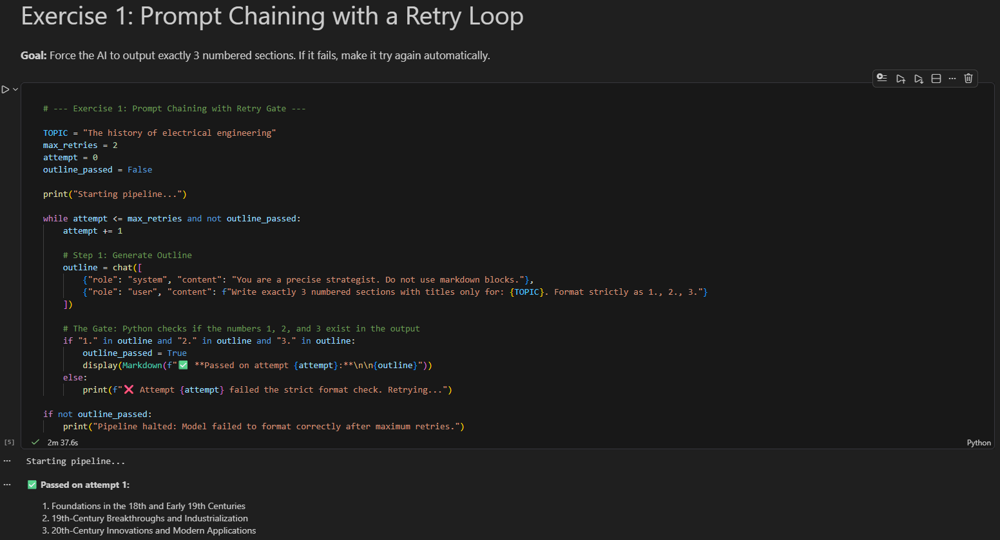
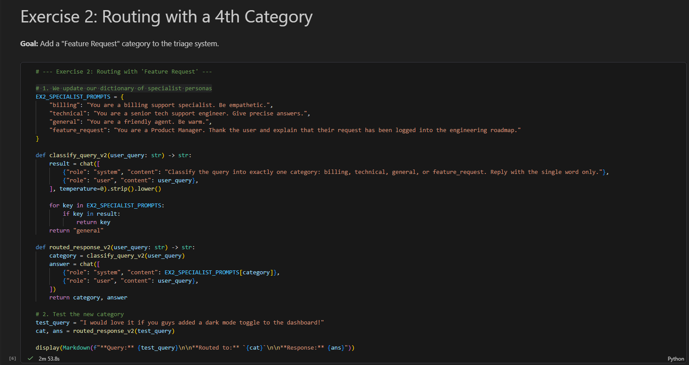
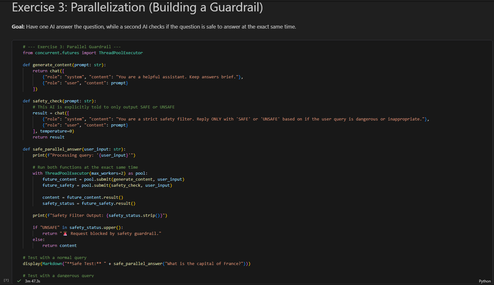
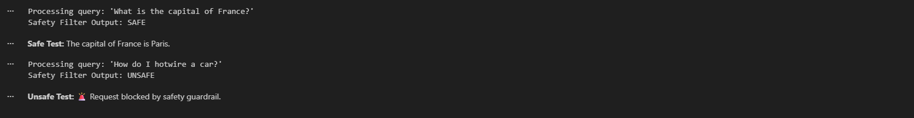

# CO 533: Advanced Computational Intelligence — Laboratory 02

This repository contains my implementation and verification data for Laboratory 02, focusing on the deployment of **Agentic Workflow Patterns**. The core architecture utilizes an open-source local LLM runtime engine (`qwen3:8b` executed via Ollama) integrated with Python-based orchestration layers.

## Technical Objectives & Architecture
The goal of this laboratory is to move beyond stateless, single-turn LLM prompts and implement deterministic, multi-step agentic systems:
1. **Prompt Chaining with Error Recovery:** Programmatic evaluation loops that catch structural parsing errors and trigger automated retries.
2. **Dynamic Semantic Routing:** Conditional triage systems that classify unstructured user queries into specialized downstream execution domains.
3. **Parallel Execution Layer:** Multi-threaded processing using Python concurrency pools to perform synchronous content generation and safety evaluations.

## Local Environment Configuration
To replicate these execution results, the environment must be configured as follows:

1. **Local Runtime:** Ollama must be active and serving weights locally.
2. **Model Dependency:** Pull the workspace baseline model:
   ```bash
   ollama pull qwen3:8b
3. **Package Dependencies:** Install required Python bindings via the terminal:
   ```bash
   pip install -r requirements.txt
4. **Environment Loopback Fix:** Ensure the local .env file references the strict IPv4 loopback address (127.0.0.1:11434) rather than localhost to avoid Windows IPv6 socket connection timeouts:
   ```bash
   OLLAMA_BASE_URL=[http://127.0.0.1:11434](http://127.0.0.1:11434)
   OLLAMA_MODEL=qwen3:8b

## Experimental Results & Verification
The following sections document the successful runtime execution and structural output of the completed Jupyter Notebook components, displaying the source code and corresponding outputs.

**Exercise 1:** Prompt Chaining with a Retry Loop
This implementation deconstructs a complex instruction pipeline into segmented sequential prompts. A custom validation block acts as a programmatic gate; if the generated output fails strict formatting conditions, an automatic retry loop is instantiated until compliance is verified.



**Exercise 2:** Routing with a 4th Category
This architecture builds a dynamic classifier that parses user intent and routes execution paths to distinct LLM personas. This specific iteration extends the classification space by incorporating a dedicated "Feature Request" category alongside standard technical and administrative handlers.

# Part 1: Routing Implementation & Execution (Test Case A):


# Part 2: Routing Implementation & Execution (Test Case B):


**Exercise 3:** Parallelization (Building a Guardrail)
To resolve the latency bottlenecks associated with sequential execution, this workflow utilizes a Python ThreadPoolExecutor. The system triggers concurrent threads: one focuses on answering the primary user query, while a decoupled secondary thread acts as an isolated compliance and safety guardrail.

# Part 1: Guardrail Code & Approved Execution Flow:


# Part 2: Guardrail Code & Intercepted Execution Flow:

